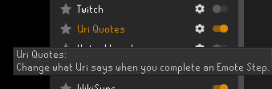
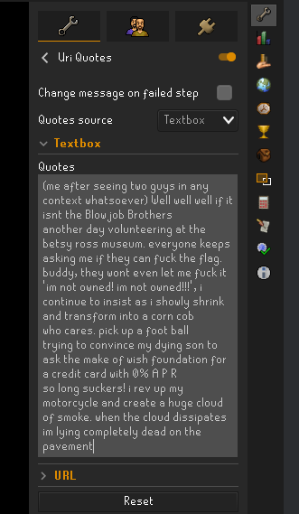
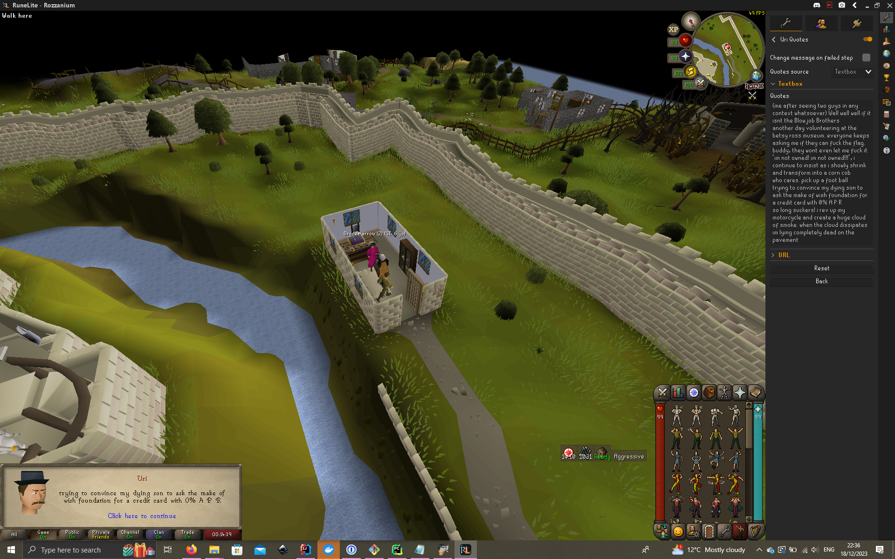
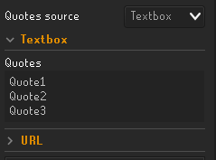
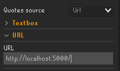

# Uri Quotes
Plugin that allows you to provide your own text for Uri's funny quotes. Inspired
by https://old.reddit.com/r/2007scape/comments/18ksax8/had_a_delusional_idea_where_all_of_uris_little/.

## How to use

1. Install Uri Quotes from the RuneLite plugin hub.

2. Open the Configure menu. 

3. Chose your mode, and fill out the appropriate fields. 

4. Meet up with Uri! 

## Modes

There are multiple modes which allow you to provide quotes for Uri to say in
different ways. Currently, there are 2 different modes, and more may come in the
future!

### TextBox

TextBox mode allows you to directly input quotes into the config field. Useful
for static quotes, or changing them quickly on the fly.

### URL

URL mode will make a HTTP request to a provided endpoint, and use the response
body as the input quotes. Could be used for more dynamic quotes, e.g. at
different times of day.
